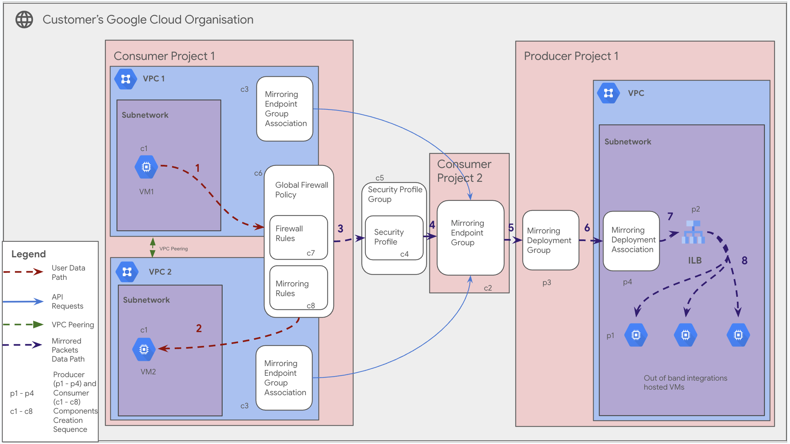

# Configure End-to-End Network Security Integration(NSI) Out of band (Packet Mirroring 2.0)

**On this page**

- [Introduction](#introduction)
- [Objectives](#objectives)
- [Architecture](#architecture)
  - [Mirrored Packets Data Path](#mirrored-packets-data-path)
  - [Architecture Components](#architecture-components)
- [Deploy the solution](#deploy-the-solution)
  - [Prerequisites](#prerequisites)
  - [Deploy through “terraform-cli”](#deploy-through-terraform-cli)
- [Submit feedback](#submit-feedback)

### Introduction

This document provides guidance on configuring and deploying an end-to-end **Google Cloud Network Security Integration(NSI) Out of Band** solution. Network Security Integration (NSI) is a Google Cloud service that seamlessly integrates third-party security appliances into your VPC, allowing you to redirect specific network traffic to them for advanced, out-of-band inspection and visibility. NSI Out of Band allows you to clone traffic from specific sources in a consumer network and send it to a collector destination (in a producer network) for inspection. This is critical for security analysis, intrusion detection, application performance monitoring, and troubleshooting.

This guide leverages a modular, YAML-driven approach to automate the deployment of the necessary NSI Out of Band policies and their dependencies across multiple Google Cloud projects. It uses a combination of Terraform configurations to provision the resources reliably and consistently.

### Objectives

This solution guide helps you do the following:

* Understand a multi-project NSI Out of Band architecture.
* Learn about the core components: **Mirroring Deployment Group**, **Mirroring Deployment**, **Mirroring Endpoint Group**, and **Mirroring Endpoint Group Association**.
* Learn how a **Security Profile** is used to enable mirroring via a Firewall Policy.
* Visualize the flow of mirrored packets from a consumer VPC to a collector.
* Deploy the full solution using the provided Terraform configurations.

### Architecture

The architecture for this Packet Mirroring solution involves multiple projects to segregate duties and resources, which is a common enterprise pattern. A **Producer Project** contains the tools and infrastructure used to receive and analyze the mirrored traffic, such as a collector behind an Internal Load Balancer (ILB). One or more **Consumer Projects** contains the workloads whose traffic you want to inspect.

The entire process is orchestrated by a Firewall Policy that uses a `CUSTOM_MIRRORING` Security Profile to redirect traffic.



### Mirrored Packets Data Path

The diagram illustrates the flow of mirrored packets from the source to the collector destination. The numbers in the diagram correspond to the following steps:

1.  **User VM:** A workload VM (`c1`) in the Consumer Project generates network traffic. This is the traffic we want to mirror.
2.  **Firewall Policy Interception:** A Global Firewall Policy associated with the Consumer VPC contains a mirroring rule. This rule inspects the traffic from the workload VM.
3.  **Security Profile Group:** If the traffic matches the mirroring rule's criteria (e.g., specific protocol and port), the rule's action (`MIRROR`) directs the traffic to the specified **Security Profile Group**.
4.  **Security Profile:** The Security Profile Group contains a **Security Profile** of type `CUSTOM_MIRRORING`.
5.  **Endpoint Group:** The Security Profile is configured to send the mirrored packets to a **Mirroring Endpoint Group** located in a designated Consumer Project.
6.  **Deployment Group:** The Endpoint Group is linked to a **Mirroring Deployment Group** back in the Producer Project. This acts as the regional container for the collector infrastructure.
7.  **Deployment & Forwarding Rule:** The Deployment Group directs the packets to a specific **Mirroring Deployment**, which is tied to a regional Internal Load Balancer (ILB) via its forwarding rule.
8.  **Collector VMs:** The ILB distributes the mirrored packets (encapsulated in GENEVE) to the backend collector VMs, which can then process or store the traffic for analysis. The third party process such as Fortinet etc. run in these collector VMs.

### Architecture Components

The diagram depicts the following key architecture components:

* **Consumer Project/VPC:** Contains the source workloads whose traffic is to be mirrored.
* **Producer Project/VPC:** Contains the collector infrastructure that receives and analyzes the mirrored traffic.
* **Mirroring Deployment Group:** A regional container in the producer project that groups one or more collector destinations (`Mirroring Deployments`).
* **Mirroring Deployment:** A zonal resource that represents a specific collector instance (an ILB forwarding rule).
* **Mirroring Endpoint Group:** A global resource in a consumer project that acts as a destination for mirrored packets.
* **Mirroring Endpoint Group Association:** A resource that connects a consumer network to the Endpoint Group, authorizing it to receive traffic.
* **Security Profile (Custom Mirroring):** An organization-level policy that defines the mirroring destination (`Mirroring Endpoint Group`).
* **Security Profile Group:** An organization-level container for a Security Profile, which is attached to a firewall rule.
* **Global Firewall Policy:** A container for firewall rules, including the mirroring rule, associated with a VPC.
* **Collector ILB:** An Internal Load Balancer that receives the mirrored traffic and distributes it to a pool of collector VMs.

### Deploy the solution

This section guides you through the process of deploying the solution.

### Prerequisites

For the common prerequisites for this repository, please refer to the **[prerequisites.md](../../prerequisites.md)** guide. Any additional prerequisites specific to this user journey will be listed below.

Before trying out the solution the following roles are needed at **project level**
  * "roles/compute.packetMirroringAdmin",
  * "roles/networksecurity.mirroringDeploymentAdmin",
  *	"roles/networksecurity.mirroringEndpointAdmin",
  *	"roles/compute.networkAdmin",
  *	"roles/compute.instanceAdmin",
  *	"roles/iam.serviceAccountAdmin",
  *	"roles/storage.admin",
  *	"roles/compute.securityAdmin",
  *	"roles/iam.serviceAccountTokenCreator",
  *	"roles/serviceusage.serviceUsageConsumer",

The following roles are needed at **organization level**
  * "roles/compute.orgFirewallPolicyAdmin",
  *	"roles/networksecurity.securityProfileAdmin",

The required APIs for this user journey is mentioned in the [01-organization stage(APIs)](#01-organization-stageapis)

**NOTE: For this user journey have two projects handy one for producer side and one for consumer side. These project ids will be refered to in the docs as producer-project-id and consumer-project-id**

### Deploy through “terraform-cli”

1.  **Clone the** `cloudnetworking-config-solutions` repository **:**

    ```
    git clone https://github.com/GoogleCloudPlatform/cloudnetworking-config-solutions.git
    ```

2.  Navigate to **`cloudnetworking-config-solutions`** folder and update the files containing the configuration values
    * **00-bootstrap stage**
        * Update `configuration/bootstrap.tfvars` **-** update the google cloud project IDs and the user IDs/groups in the tfvars.

          ```
          bootstrap_project_id                      = "<your-project-id>"
          network_hostproject_id                    = "<your-project-id>"
          nsi_administrator                         = ["user:nsi-user-example@example.com"]
          # ... and other administrator principals
          ```

    <a id="terraform-workspace-declaration"></a>
    **NOTE: We will be using [terraform workspaces](https://developer.hashicorp.com/terraform/cli/workspaces) to deploy the consumer organization and networking stages**

    <a id="01-organization-stageapis"></a>
    * **01-organization stage(APIs)**
        * Update `configuration/organization.tfvars` - update the google cloud project ID and the list of the APIs to enable for the Packet Mirroring solution.

          **Sample tfvars for producer project api enablement(organization.tfvars)**
          ```
          activate_api_identities = {
          "packet-mirroring-project" = {
              project_id = "<producer-project-id>",  # Replace with your actual project ID
              activate_apis = [
              "iam.googleapis.com",
              "compute.googleapis.com",
              "networksecurity.googleapis.com",
              "cloudresourcemanager.googleapis.com",
              "storage.googleapis.com"
              ],
          },
          }
          ```
        <a id="consumer-org-tfvars"></a>
        * Make a copy of the `configuration/organization.tfvars` and rename it as `consumer-org.tfvars` , this will be used to enable the required apis in the consumer project.

          **Sample tfvars for consumer project api enablement(consumer-org.tfvars)**
          ```
          activate_api_identities = {
          "packet-mirroring-project" = {
              project_id = "<consumer-project-id>",  # Replace with your actual project ID
              activate_apis = [
              "iam.googleapis.com",
              "compute.googleapis.com",
              "networksecurity.googleapis.com",
              "cloudresourcemanager.googleapis.com",
              "storage.googleapis.com"
              ],
          },
          }
          ```

    * **02-networking stage(VPC and Subnets)**
        * Update `configuration/networking.tfvars` - This will be used to create the required VPC and subnets in the producer project. Update the appropriate project_id, vpc_name, and subnets values. 

          **Sample tfvars for producer VPC creation(networking.tfvars)**
          ```
          project_id = "<producer-project-id>" # <-- Replace
          region     = "us-central1"         # <-- Replace

          ## VPC input variables

          network_name = "producer-vpc"
          subnets = [
            {
              name                  = "producer-subnet-us-central1"
              ip_cidr_range         = "10.10.1.0/24"
              region                = "us-central1"
              enable_private_access = true
            }
          ]
            # Configuration for setting up a Shared VPC Host project, enabling centralized network management and resource sharing across multiple projects.
            shared_vpc_host = false

            # PSC/Service Connectivity Variables

            create_scp_policy      = false # Use true or false based on your requirements
            subnets_for_scp_policy = [""]  # List subnets here from the same region as the SCP

            ## Cloud Nat input variables
            create_nat = false # Use true or false 

            ## Cloud HA VPN input variables

            create_havpn = false
            peer_gateways = {
              default = {
                gcp = "" # e.g. projects/<google-cloud-peer-projectid>/regions/<google-cloud-region>/vpnGateways/<peer-vpn-name>
              }
            }

            tunnel_1_router_bgp_session_range = ""
            tunnel_1_bgp_peer_asn             = 64514
            tunnel_1_bgp_peer_ip_address      = ""
            tunnel_1_shared_secret            = ""

            tunnel_2_router_bgp_session_range = ""
            tunnel_2_bgp_peer_asn             = 64514
            tunnel_2_bgp_peer_ip_address      = ""
            tunnel_2_shared_secret            = ""

            ## Cloud Interconnect input variables

            create_interconnect = false # Use true or false
            create_psa = false

          ```
          <a id="consumer-net-tfvars"></a>
        * Make a copy of the `configuration/networking.tfvars` and rename it as `consumer-net.tfvars`, this will be used to create the required VPC and subnets in the consumer project. Update the appropriate project_id, vpc_name, and subnets values.
          **Sample tfvars for consumer VPC creation(consumer-net.tfvars)**
          ```
          project_id = "<consumer-project-id>" # <-- YOUR PROJECT ID
          region     = "us-central1"

          network_name = "consumer-vpc" # <-- Consumer VPC
          subnets = [
            {
              name                  = "consumer-subnet-us-central1"
              ip_cidr_range         = "10.20.10.0/24" # <-- Consumer Subnet Range
              region                = "us-central1"
              enable_private_access = true
            }
          ]

          # Configuration for setting up a Shared VPC Host project, enabling centralized network management and resource sharing across multiple projects.
          shared_vpc_host = false

          # PSC/Service Connecitvity Variables

          create_scp_policy      = false # Use true or false based on your requirements
          subnets_for_scp_policy = [""]  # List subnets here from the same region as the SCP

          ## Cloud Nat input variables
          create_nat = false # Use true or false 

          ## Cloud HA VPN input variables

          create_havpn = false
          peer_gateways = {
            default = {
              gcp = "" # e.g. projects/<google-cloud-peer-projectid>/regions/<google-cloud-region>/vpnGateways/<peer-vpn-name>
            }
          }

          tunnel_1_router_bgp_session_range = ""
          tunnel_1_bgp_peer_asn             = 64514
          tunnel_1_bgp_peer_ip_address      = ""
          tunnel_1_shared_secret            = ""

          tunnel_2_router_bgp_session_range = ""
          tunnel_2_bgp_peer_asn             = 64514
          tunnel_2_bgp_peer_ip_address      = ""
          tunnel_2_shared_secret            = ""

          ## Cloud Interconnect input variables

          create_interconnect = false # Use true or false
          create_psa = false

          ```

    * **03-security stage(Global Firewall Policy and Firewall Rules)**
        * Create a YAML file inside the `security/Firewall/FirewallPolicy/config/` directory (e.g., `global-instance.yaml`). This will define the values for the creation of global firewall policy.
          ```yaml
          name      : "lite-global-firewallpolicy"
          parent_id : "<consumer-project-id>" # project_id incase of global/regional firewall policy.
          region : global

          ```
        * Update the tfvars file inside the `security/mig.tfvars` This will define the values for the creation of required firewall rules to allow healthchecks for the Internal Passthrough Network Load Balancer.
          ```
          project_id = "<producer-project-id>"
          network    = "producer-vpc"
          ingress_rules = {
            fw-allow-health-check = {
              deny               = false
              description        = "Allow health checks"
              destination_ranges = []
              disabled           = false
              enable_logging = {
                include_metadata = true
              }
              priority = 1000
              source_ranges = [
                "130.211.0.0/22",
                "35.191.0.0/16"
              ]
              targets = ["allow-health-checks"]
              rules = [{
                protocol = "tcp"
                ports    = ["80"]
              }]
            }
          }
          ```

    * **03-security stage(Google Managed SSL Certificates)**
        * Update `configuration/security/Certificates/Compute-SSL-Certs/Google-Managed/google_managed_ssl.tfvars` - update the google cloud project ID in the google_managed_ssl.tfvars.
          ```
          project_id           = "<producer-project-id>"
          ssl_certificate_name = "my-managed-ssl-cert"
          ssl_managed_domains = [
            {
              domains = ["example.com", "www.example.com"]
            }
          ]
          ```


    * **05-producer-connectivity stage**
        * For this user journey we do not need to create any psc connections hence go to `configuration/producer-connectivity.tfvars` and update the contents of producer-connectivity.tfvars file to look like this.
          ```
          psc_endpoints = []
          ```

    * **06-consumer stage(GCE/MIG/UMIG)**
        * Create a YAML file inside the `consumer/MIG/config` directory (e.g., `mig.yaml`). This will define the required attributes to create managed instance groups (MIG). Alternatively Google compute engine (GCE) or Unmanaged Instance Group (UMIG) can be used too by modifying their respective configs. In this example we will create a Managed Instance Group (MIG) hence we should create a YAML file inside the consumer/MIG/config directory.
          ```yaml
          name: minimal-mig
          project_id: "<producer-project-id>"
          location: "us-central1"
          zone : "us-central1-a"
          vpc_name : "producer-vpc"
          subnetwork_name : "producer-subnet-us-central1"
          named_ports:
              http: 80
              https: 443
          ```

    * **07-Consumer-Load-Balancing(IPNLB)**
        * Create a YAML file inside the `consumer-load-balancing/Network/Passthrough/Internal/config` directory (e.g., `ipnlb.yaml`). This will define the Internal Passthrough Network Load Balancer.
          ```yaml
          name: internal-lb-lite
          project: "<producer-project-id>"
          region: us-central1
          network: producer-vpc
          subnetwork: producer-subnet-us-central1
          backends:
            - group_name: minimal-mig
          is_mirroring_collector: true
          forwarding_rule:
            protocol: UDP
            ports: [6081]
          ```

    * **08-network-security-integration/Out-Of-Band stage(NSI Out-of-Band)**
        * Create a YAML file inside the `network-security-integration/Out-Of-Band/config/` directory (e.g., `mirroring-setup.yaml`). This defines the core Packet Mirroring resources.
          ```yaml
          deployment_group:
            create: true
            deployment_group_project_id: "<producer-project-id>"
            name: "cncs-deployment-group"
            description: "CNCS Deployment Group"
            producer_network_link: "projects/<producer-project-id>/global/networks/producer-vpc"

          endpoint_group:
            create: true
            endpoint_group_project_id: "<consumer-project-id>"
            name: "cncs-endpoint-group"
            description: "CNCS Endpoint Group"

          # List of deployments to create under the single deployment_group
          deployments:
            - deployment_project_id: "<producer-project-id>"
              name: "cncs-deployment"
              location: "us-central1-a"
              forwarding_rule_link: "projects/<producer-project-id>/regions/us-central1/forwardingRules/internal-lb-lite"
              description: "CNCS Deployment"

          # List of associations to create under the single endpoint_group
          endpoint_associations:
            - endpoint_association_project_id: "<consumer-project-id>"
              name: "cncs-endpoint-association"
              consumer_network_link: "projects/<consumer-project-id>/global/networks/consumer-vpc"
          ```

    * **08-network-security-integration/SecurityProfile stage(Security Profiles)**
        * Create a YAML file inside the `network-security-integration/SecurityProfile/config/` directory (e.g., `security-profile.yaml`). This will define the Security Profile and Group that enable mirroring. IMPORTANT: This stage operates at the organization level. You must configure the provider with organization-level credentials by renaming `execution/08-network-security-integration/SecurityProfile/provider.tf.template` to `provider.tf` and filling in your organization details you want this resouce to use like the billing project id ( project if that will be billed for this resource).
          ```yaml
          organization_id: <organization-id> # <-- Replace
          project_id: <consumer-project-id> # Billing Project

          security_profile:
            create: true
            name: "prod-custom-mirroring-sp"
            type: "CUSTOM_MIRRORING"
            custom_mirroring_profile:
              # This value will come from the output of the Packet Mirroring module
              mirroring_endpoint_group: "projects/<consumer-project-id>/locations/global/mirroringEndpointGroups/cncs-endpoint-group"

          security_profile_group:
            create: true
            name: "prod-mirroring-spg"

          link_profile_to_group: true
          
          firewall_policy_name: "lite-global-firewallpolicy" # The policy to add the mirroring rule to
          ```

    * **08-network-security-integration/PacketMirroringRule stage(Packet Mirroring Rule)**
        * Create a YAML file inside the `network-security-integration/PacketMirroringRule/config/` directory (e.g., `mirroring-rule-profile.yaml`). This will define the Packet Mirroring Rule in the global firewall policy.
          ```yaml
          priority: 1010
          project_id: <consumer-project-id>
          firewall_policy_name: "lite-global-firewallpolicy"
          direction: INGRESS
          security_profile_group: "organizations/<organization-id>/locations/global/securityProfileGroups/prod-mirroring-spg"
          description: "CNCS Packet Mirroring Rule"
          action: "mirror"
          match:
            src_ip_ranges:
              - "10.20.10.0/24"
            layer4_configs:
              - ip_protocol: "udp"
                ports: ["50051"]
          ```


3.  **Execute the terraform script**

    **IMPORTANT : run.sh automation doesnot work for [consumer-org.tfvars](#consumer-org-tfvars)  and [consumer-net.tfvars](#consumer-net-tfvars) as mentioned [here](#terraform-workspace-declaration), follow the steps manually mentioned below**

    Navigate to `execution/01-organization` and run the following commands
      ```
      terraform workspace new consumer
      terraform init
      terraform apply -var-file="../../configuration/consumer-org.tfvars" -auto-approve
      terraform workspace select default
      ```
    Navigate to `execution/02-networking` and run the following commands
      ```
      terraform workspace new consumer
      terraform init
      terraform apply -var-file="../../configuration/consumer-net.tfvars" -auto-approve
      terraform workspace select default
      ```

    Now that you have successfully deployed the consumer side networks and APIs using consumer-net.tfvars and consumer-org.tfvars respectively, you can now deploy all the stages for other resources individually using **run.sh** or you can deploy all the stages automatically using the run.sh file. Navigate to the `execution/` directory and run this command to run the automatic deployment using **run.sh**.

      ```
      export USER_PROJECT_OVERRIDE=true
      export GOOGLE_BILLING_PROJECT=<consumer-project-id>
      ./run.sh -s all -t init-apply-auto-approve
      ```
      or
      ```
      export USER_PROJECT_OVERRIDE=true
      export GOOGLE_BILLING_PROJECT=<consumer-project-id>
      ./run.sh --stage all --tfcommand init-apply-auto-approve
      ```

4.  **Verify Packet Mirroring Deployment:**
    Once the deployment is complete, navigate to the **VPC Network -> Packet Mirroring** section in the Google Cloud Console to confirm that your policies have been successfully created. You can also use `gcloud` to describe the resources.

### Optional: Delete the deployment

1.  In Cloud Shell or in your terminal, make sure that the current working directory is `$HOME/cloudshell_open/<Folder-name>/execution`. If it isn't, go to that directory.
2.  Remove the resources that were provisioned by the solution guide:
    ```
    ./run.sh -s all -t destroy-auto-approve
    ```
    Terraform displays a list of the resources that are destroyed.
    **IMPORTANT : run.sh automation doesnot work for consumer-org.tfvars and consumer-net.tfvars as mentioned [here](#terraform-workspace-declaration), follow these steps manually mentioned below to delete resources created by [consumer-org.tfvars](#consumer-org-tfvars)  and [consumer-net.tfvars](#consumer-net-tfvars).**
    
    Now navigate to `execution/02-networking` and run the following commands
      ```
      terraform workspace select consumer
      terraform destroy -var-file="../../configuration/consumer-net.tfvars" -auto-approve
      terraform workspace select default
      terraform workspace delete consumer
      ```
    Now navigate to `execution/01-organization` and run the following commands
      ```
      terraform workspace select consumer
      terraform destroy -var-file="../../configuration/consumer-org.tfvars" -auto-approve
      terraform workspace select default
      terraform workspace delete consumer
      ```

### Submit feedback

For common troubleshooting steps and solutions, please refer to the **[troubleshooting.md](../../troubleshooting.md)** guide.

To provide feedback, please follow the instructions in our **[submit-feedback.md](../../submit-feedback.md)** guide.