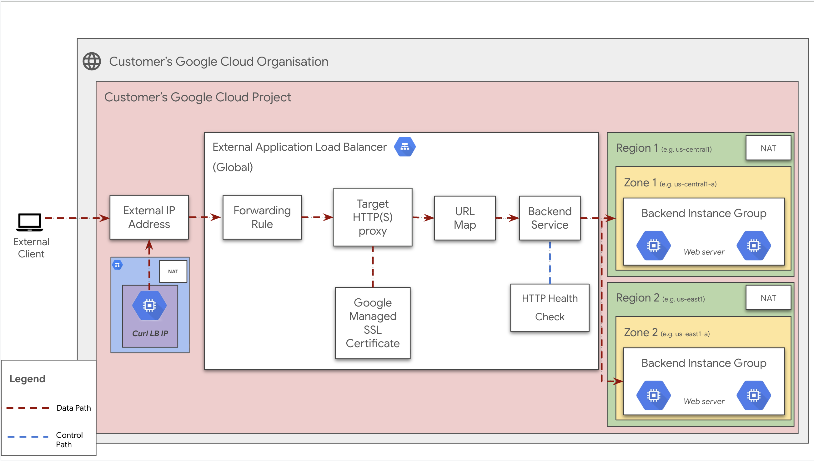

# Google Managed SSL Certificates

**On this page**

  1. Objectives

  2. Architecture

  3. Request flow

  4. Architecture Components

  5. Deploy the solution

  6. Prerequisites

  7. Deploy with "single click"

  8. Deploy through “terraform-cli”

  9. Optional: Delete the deployment

  10. Submit feedback

## Introduction

This Terraform module facilitates the creation and management of Google Compute Managed SSL Certificate. Google Compute Managed SSL Certificate are SSL/TLS certificates that you can provision, deploy, and manage for your domains. These certificates are obtained and renewed automatically by Google, simplifying the lifecycle management of your SSL/TLS configurations.

Managed SSL certificates are essential for enabling HTTPS traffic for your applications served via Google Cloud External HTTP(S) Load Balancers. By using Google-managed certificates, you delegate the complexities of certificate issuance and renewal to Google, ensuring your applications remain secure and accessible over HTTPS.

## Objective

The primary objectives of using SSL are:

*   **Encryption:** Encrypting the data that is transmitted between the user's browser and the web server.
*   **Authentication:** Verifying the identity of the website you are connecting to.
*   **Data Integrity:** Ensuring that the data has not been tampered with during transmission.

This user journey will guide you through the process of creating a Google-managed SSL certificate to achieve these objectives for your domain.

## Architecture
This diagram shows a Google Cloud deployment using a global external HTTP(S) load balancer to distribute traffic across backend services located in two separate regions. It utilizes Google’s global network and anycast IP addresses to ensure efficient traffic routing and high availability.

* **Scenario : this architecture describes a Google Cloud setup for a highly available and externally accessible service. The system uses a global external load balancer to distribute traffic across multiple regions.**

<a href="https://github.com/GoogleCloudPlatform/cloudnetworking-config-solutions/blob/main/docs/SSLCertificates/images/ssl-certs.png" target="_blank">
  
</a>

# Request Flow

## Architecture Components

*   **External Client:** The user or system initiating a request from outside the Google Cloud environment.
*   **External IP Address:** A single, global anycast IP address that serves as the public entry point for all incoming traffic.
*   **External Application Load Balancer (Global):** A global load balancing service that distributes traffic across multiple regions.
*   **Forwarding Rule:** Directs incoming traffic from the external IP address to the Target HTTPS proxy.
*   **Target HTTP(S) proxy:** This component terminates the client's HTTPS connection.
*   **URL Map:** Routes requests to the appropriate backend service based on the requested URL's host and path.
*   **Google Managed SSL Certificate:** Used by the Target HTTPS Proxy to encrypt and decrypt traffic.
*   **Backend Service:** A logical collection of backend instance groups. It directs traffic to the appropriate backends and monitors their health via HTTP Health Checks.
*   **Backend Instance Group:** A group of virtual machine instances that run the web server application, distributed across different zones and regions for high availability.
*   **NAT (Network Address Translation):** Allows the backend instances to initiate outbound connections to the internet.

## Request Flow Steps

1.  **Request Initiation:** An **External Client** sends an HTTPS request to the **External IP Address** of the load balancer.
2.  **Traffic Forwarding:** The **Forwarding Rule** receives the request and directs it to the **Target HTTP(S) proxy**.
3.  **SSL Termination and Routing:** The **Target HTTP(S) proxy** decrypts the request using the **Google-Managed SSL Certificate**. It then uses the **URL Map** to determine which **Backend Service** should handle the request based on its URL.
4.  **Backend Selection:** The **Backend Service** forwards the decrypted request to a healthy instance within a **Backend Instance Group**. The load balancer automatically selects a backend based on factors like the region closest to the user and the health of the instances.
5.  **Response:** The backend instance processes the request and sends a response back to the load balancer. The Target HTTPS Proxy then re-encrypts the response before sending it back to the client. The data path is represented by the solid black lines in the diagram, while the health check control path is shown with the blue dashed lines.


## Deploy the Solution

This section provides instructions on deploying the load balancer solution with SSL using Terraform.

### **Prerequisites**

For the common prerequisites for this repository, please refer to the **[prerequisites.md](../prerequisites.md)** guide.

### Deploy with "single-click"

This method uses Google Cloud Shell and Cloud Build to automate the deployment of the Application External Load Balancer with Google Managed SSL certs and MIG backend.

1.  **Open in Cloud Shell:** Click the button below to clone the repository and open the necessary configuration files in the Cloud Shell editor.

    **Note**: For testing, ensure the `cloudshell_git_repo` and `cloudshell_git_branch` parameters in the URL point to your fork and specific branch where these "single click" files and the updated guide exist. For the final version, this will point to the main repository.

    <a href="https://ssh.cloud.google.com/cloudshell/editor?shellonly=true&cloudshell_git_repo=https://github.com/GoogleCloudPlatform/cloudnetworking-config-solutions.git&cloudshell_git_branch=main&cloudshell_workspace=.&cloudshell_open_in_editor=configuration/bootstrap.tfvars,configuration/organization.tfvars,configuration/networking.tfvars,configuration/security/Certificates/Compute-SSL-Certs/Google-Managed/google_managed_ssl.tfvars,configuration/security/mig.tfvars,configuration/consumer/MIG/config/instance.yaml.example,configuration/consumer-load-balancing/Application/External/config/instance1.yaml.example&cloudshell_tutorial=docs/SSLCertificates/google-managed-ssl-journey.md#deploy-with-single-click" target="_new">
    
    </a>

2.  **Run Application Load Balancer with SSL Prerequisites Script:**
    This script prepares your Google Cloud project: enables APIs, creates a Terraform state bucket for Application Load Balancer, and sets Cloud Build permissions. From the root of the cloned `cloudnetworking-config-solutions` directory in Cloud Shell, run:

    ```bash
    sh docs/SSLCertificates/helper-scripts/prereq-ssl.sh
    ```

    When prompted, enter your Google Cloud Project ID.

3.  **Review and Update Configuration Files:**
    The Cloud Shell editor will open key configuration files. Review each file and update values (project IDs, user IDs/groups, network names, regions, etc.) as per your requirements. Follow the guidance in the "Deploy through Terraform-cli" section of this document for details on each file:

      * `configuration/bootstrap.tfvars`
      * `configuration/organization.tfvars`
      * `configuration/networking.tfvars`
      * `configuration/security/Certificates/Compute-SSL-Certs/Google-Managed/google_managed_ssl.tfvars`
      * `configuration/security/mig.tfvars`
      * `configuration/consumer/MIG/config/instance.yaml.example` (Rename to `instance.yaml` after updating.)
      * `configuration/consumer-load-balancing/Application/External/config/instance1.yaml.example` (Rename to `instance1.yaml` after updating.)

    When prompted, enter your Google Cloud Project ID.

4.  **Submit Cloud Build Job to Deploy Application Load Balancer :**
    Once configurations are updated and prerequisites are met, submit the Cloud Build job. Ensure you are in the root of the cloned repository.

    ```bash
    gcloud builds submit . --config docs/SSLCertificates/build/cloudbuild-ssl.yaml --ignore-file=".gcloudignore"
    ```

5.  **Verify Deployment:**

    After the Cloud Build job completes, go to the "Load Balancing" section in the Google Cloud Console. Confirm your Application External Load Balancer is created, with SSL certificates and the MIG is attached as a backend and healthy.

6.  **[Optional] Delete the Deployment using Cloud Build:**

    To remove all resources created by this deployment, run the destroy Cloud Build job:

    ```bash
    gcloud builds submit . --config docs/SSLCertificates/build/cloudbuild-ssl-destroy.yaml --ignore-file=".gcloudignore"
    ```

### **Deploy through Terraform-cli**

1. Clone the repository containing the Terraform configuration files:

    ```bash
    git clone https://github.com/GoogleCloudPlatform/cloudnetworking-config-solutions.git
    ```

2. Navigate to **cloudnetworking-config-solutions** folder and update the files containing the configuration values
   * **00-bootstrap stage**
     * Update configuration/bootstrap.tfvars **\-** update the google cloud project IDs and the user IDs/groups in the tfvars.

        ```
        bootstrap_project_id                      = "your-project-id"
        network_hostproject_id                    = "your-project-id"
        network_serviceproject_id                 = "your-project-id"
        organization_stage_administrator          = ["user:user-example@example.com"]
        networking_stage_administrator            = ["user:user-example@example.com"]
        security_stage_administrator              = ["user:user-example@example.com"]
        producer_stage_administrator              = ["user:user-example@example.com"]
        producer_connectivity_stage_administrator = ["user:user-example@example.com"]
        consumer_stage_administrator              = ["user:user-example@example.com"]
        consumer_lb_administrator                 = ["user:lb-user-example@example.com"]
        ```

   * **01-organisation stage**
     * Update configuration/organization.tfvars \- update the google cloud project ID and the list of the APIs to enable for the MIG & Load Balancer.

        ```
            activate_api_identities = {
            "project-01" = {
                project_id = "your-project-id",
                activate_apis = [
                "servicenetworking.googleapis.com",
                "iam.googleapis.com",
                "compute.googleapis.com",
                "cloudresourcemanager.googleapis.com",
                "serviceusage.googleapis.com",
                ],
            },
            }

        ```
   * **02-networking stage**
     * Update `configuration/networking.tfvars` update the Google Cloud Project ID and the parameters for additional resources such as VPC, subnet, and NAT as outlined below.

        ```
        project_id  = "your-project-id"
        region      = "us-central1"

        ## VPC input variables
        network_name = "cncs-vpc"
        subnets = [
        {
            ip_cidr_range = "10.0.0.0/24"
            name          = "cncs-vpc-subnet-1"
            region        = "us-central1"
        }
        ]

        shared_vpc_host = false

        ## PSC/Service Connectivity variable
        create_scp_policy  = false

        ## Cloud Nat input variables
        create_nat = true

        ## Cloud HA VPN input variables

        create_havpn = false
        peer_gateways = {
        default = {
            gcp = "" # e.g. projects/<google-cloud-peer-projectid>/regions/<google-cloud-region>/vpnGateways/<peer-vpn-name>
        }
        }

        tunnel_1_router_bgp_session_range = ""
        tunnel_1_bgp_peer_asn             = 64514
        tunnel_1_bgp_peer_ip_address      = ""
        tunnel_1_shared_secret            = ""

        tunnel_2_router_bgp_session_range = ""
        tunnel_2_bgp_peer_asn             = 64514
        tunnel_2_bgp_peer_ip_address      = ""
        tunnel_2_shared_secret            = ""

        ## Cloud Interconnect input variables

        create_interconnect = false # Use true or false


   * **03-security stage**
     * Update configuration/security/Certificates/Compute-SSL-Certs/Google-Managed/google_managed_ssl.tfvars \- update the Google Cloud Project ID. This will facilitate the creation of essential firewall rules, granting required MIG firewall rules.

        ```
        project_id           = ""
        ssl_certificate_name = "my-managed-ssl-cert"
        ssl_managed_domains = [
        {
            domains = ["example.com", "www.example.com"]
        }
        ]
        ```

   * **03-security stage**
     * Update configuration/security/mig.tfvars file \- update the Google Cloud Project ID. This will facilitate the creation of essential firewall rules, granting required MIG firewall rules.

        ```
        project_id = "your-project-id"
        network    = "cncs-vpc"
        ingress_rules = {
        fw-allow-health-check = {
            deny               = false
            description        = "Allow health checks"
            destination_ranges = []
            disabled           = false
            enable_logging = {
            include_metadata = true
            }
            priority = 1000
            source_ranges = [
                "130.211.0.0/22",
                "35.191.0.0/16"
            ]
            targets = ["allow-health-checks"]
            rules = [{
            protocol = "tcp"
            ports    = ["80"]
            }]
        }
        }
        ```

   * **06-consumer stage**
     * Update the configuration/consumer/MIG/config/instance.yaml.example file and rename it to instance.yaml.

        ```
        name: minimal-mig
        project_id: your-project-id
        location: us-central1
        zone : us-central1-a
        vpc_name : cncs-vpc
        subnetwork_name : cncs-vpc-subnet-1
        named_ports:
            http: 80
        ```

    * **07-consumer-load-balancing stage**
      * Update the configuration/consumer-load-balancing/Application/External/config/instance1.yaml.example file and rename it to instance1.yaml

        ```
        name: load-balancer-cncs
        project: your-project-id
        network: cncs-vpc
        backends:
        default:
            groups:
            - group: minimal-mig
                region: us-central1
        ```

3. **Execute the terraform script**
   You can now deploy the stages individually using **run.sh** or you can deploy all the stages automatically using the run.sh file. Navigate to the execution/ directory and run this command to run the automatic deployment using **run.sh .**

      ```
      ./run.sh -s all -t init-apply-auto-approve
      or
      ./run.sh --stage all --tfcommand init-apply-auto-approve
      ```

4. **Verify the SSL Certificate**

    Once the Terraform apply is complete, you can verify the SSL certificate in the Google Cloud Console.

    1.  Go to the **Load balancing** page in the Google Cloud Console.
    2.  Click on the **Advanced** tab.
    3.  Click on the **Certificates** tab.
    4.  You should see your newly created SSL certificate in the list.

## **Optional-Delete the deployment**

1. In Cloud Shell or in your terminal, make sure that the current working directory is $HOME/cloudshell\_open/\<Folder-name\>/execution. If it isn't, go to that directory.

2. Remove the resources that were provisioned by the solution guide:

    ```
    ./run.sh -s all -t destroy-auto-approve
    ```

Terraform displays a list of the resources that will be destroyed.

3. When you're prompted to perform the actions, enter yes.

Troubleshoot Errors
---
For common troubleshooting steps and solutions, please refer to the **[troubleshooting.md](../../troubleshooting.md)** guide.

## **Submit feedback**

To provide feedback, please follow the instructions in our **[submit-feedback.md](../../submit-feedback.md)** guide.